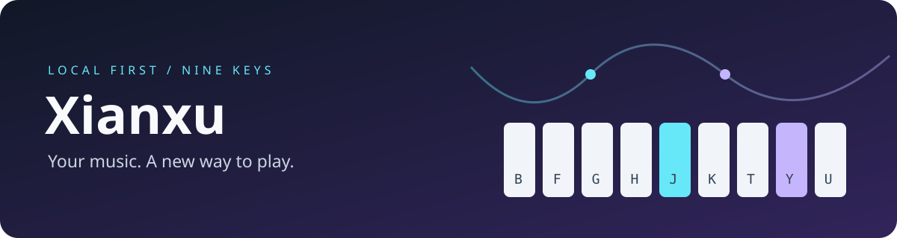

<div align="center">



# 弦序 · Xianxu

**把旋律整理成谱，把乐谱带进游戏。**

面向《洛克王国：世界》九键乐器的 Windows 桌面播放器


[](LICENSE)
[](https://github.com/Einzieg/xianxu/actions/workflows/ci.yml)

[快速开始](#快速开始) · [使用指南](docs/guide.md) · [安装包构建](docs/packaging.md) · [问题反馈](https://github.com/Einzieg/xianxu/issues)

</div>

---

## 一首歌，从导入到演奏

```text
TXT / MIDI / 本地音频 → 保留原谱 → 自动九键编配 → 对比试听 → 游戏演奏
```

| 能力 | 说明 |
| :--- | :--- |
| **谱库与队列** | 搜索、删除、导出 MIDI；顺序、随机、列表循环、单曲循环 |
| **本地音频转谱** | Basic Pitch ONNX 识别，支持主旋律音区偏好和实验性和弦模式 |
| **九键编配** | 自动移调、折八度、处理缺失音；保留原始结果供对照 |
| **分段试听** | 对比原音频、识别旋律与九键版本 |
| **专注演奏** | 捕获游戏窗口、尝试切回游戏、左上角置顶小窗 |
| **播放保护** | 失焦暂停、停止释放按键、异常不自动续播、退出时停止引擎 |
| **输入后端** | Win32 或 DD；DD 实例复用，支持多键和弦 |

> **不是无误差扒谱器。** 合奏识别可能误选声部，九键无法完整还原任意原曲，请先试听。DD 是全局输入，不是后台窗口专属发键。

## 快速开始

### 源码运行

准备 Windows x64、[PowerShell 7](https://github.com/PowerShell/PowerShell)、[uv](https://docs.astral.sh/uv/)、Node.js 22+、Rust MSVC、Visual Studio C++ Build Tools 和 WebView2。

```powershell
$ErrorActionPreference = 'Stop'
git clone https://github.com/Einzieg/xianxu.git
if ($LASTEXITCODE -ne 0) { throw 'Clone failed' }
Set-Location xianxu
uv sync --locked
if ($LASTEXITCODE -ne 0) { throw 'Dependency installation failed' }
.\Build-TauriPlayer.ps1
.\Start-TauriPlayer.ps1
```

### 独立安装包

**[下载 Windows 安装包（Releases）](https://github.com/Einzieg/xianxu/releases)**，或参阅 [构建说明](docs/packaging.md)。安装包内置 Python 引擎、模型及依赖，终端用户不需要 Python/Node/Rust，系统仍需 WebView2。

首个公开版本为含 DD 的预览版，已通过构建、独立引擎及合成音频转谱测试；尚未完成干净 Windows 虚拟机安装验收。安装、升级前请保存曲谱并正常退出旧播放器。

普通版不包含 DD。含 DD 版本可在软件安装阶段自动调用厂商驱动安装器，需要管理员授权；失败会提示，不关闭驱动签名检查，不在每次应用启动时重复安装，不在卸载软件时擅自移除共享驱动。

## 第一次演奏

1. 在游戏中打开乐器界面，设置里点击 **捕获游戏窗口**，倒计时内切回游戏。
2. 导入谱子或转换本地音频，先用 **分段试听** 和 **无按键预览** 检查结果。
3. 选择已可用的输入后端，点击播放，程序尝试切回游戏并缩为置顶小窗。

| 快捷键 | 功能 |
| :---: | :--- |
| `F8` | 开始当前曲 |
| `F9` | 暂停 / 继续 |
| `F10` | 停止并释放本轮按键 |

游戏可能影响快捷键。置顶窗口提供停止按钮，切出游戏也会触发失焦保护。不要同时运行新旧演奏器。

<details>
<summary><b>默认键位与简谱格式</b></summary>

| 按键 | B | F | G | H | J | K | T | Y | U |
| :--- | :---: | :---: | :---: | :---: | :---: | :---: | :---: | :---: | :---: |
| 音高 | A2 | E3 | F3 | G3 | A3 | B3 | C4 | D4 | E4 |

默认 `1=C3`；空格分隔，`'` 升八度，`,` 降八度，`0` 休止，`:2` 两拍，`[3 5 7]` 和弦。示例：[小星星](samples/twinkle.txt)。键位可修改或实测校准。

</details>

## 走向优先重编（离线工具）

`music_contour.py` 可对保存的曲库快照重新编配：优先保留旋律的上行、下行、高音峰值与同音重复，再重建稀疏低音。原谱、曲名、顺序和设置保留；已是九键成品或尚未确认旋律的多声部谱会保留原版，并在报告中注明。

```powershell
$ErrorActionPreference = 'Stop'
# 先保存并正常关闭播放器；将完整 library.json 备份到本地 artifacts 目录。
.\.venv\Scripts\python.exe music_contour.py artifacts/library.before.json artifacts/contour-candidate
if ($LASTEXITCODE -ne 0) { throw 'Contour rebuild failed' }
```

输出目录必须不存在。工具只生成候选 `library.json` 与 `report.json`，验证多种速度和按键时长下的事件配对，**不覆盖活库、不启动驱动、不发送按键**。试听确认后再备份并替换播放器数据。九键压缩仍有损，长音阶可能出现平台，不能恢复原谱里已经丢失的高音。

此功能目前是源码中的离线工具，**未改变播放器默认导入算法，也未包含在现有安装包中**。个人曲库与试听文件不随代码发布。

## 数据与隐私

- 谱库及设置位于 `%APPDATA%/com.rockmusic.workspace-player/`，更新不随意清空曲库。
- 应用在本地分析音频，不上传歌曲；**DD 免费版的上游说明包含加载时联网鉴权**，不承诺它完全离线。
- 仓库不附个人曲库、商业曲谱、下载歌曲、校准录音、个人设置或 DD 二进制。
- 不自动播放，不修改内存完整性、安全启动或驱动签名策略。

## 开发与贡献

```powershell
$ErrorActionPreference = 'Stop'
.\.venv\Scripts\python.exe -m unittest discover -s tests -v
if ($LASTEXITCODE -ne 0) { throw 'Tests failed' }
```

`desktop/`：Tauri + React；`music_service.py`：常驻引擎；`music_neural.py`：模型推理；`music_adapt.py` / `music_sparse.py`：编配；`music_playback.py`：播放调度。

欢迎提交问题和 PR。请提供可公开的最小复现，不附凭据、个人曲库或无权分享的音频。测试默认采用模拟输入，不向游戏发键；私人音频回归集不随仓库发布。

## 许可与致谢

原创代码采用 [MIT](LICENSE)。Basic Pitch 模型和移植逻辑遵循 Apache-2.0，其他依赖及 DD 许可边界见 [第三方说明](THIRD_PARTY_NOTICES.md)。本项目并非游戏官方产品，与游戏厂商、Spotify、Tauri 和 DD 作者无隶属关系。
